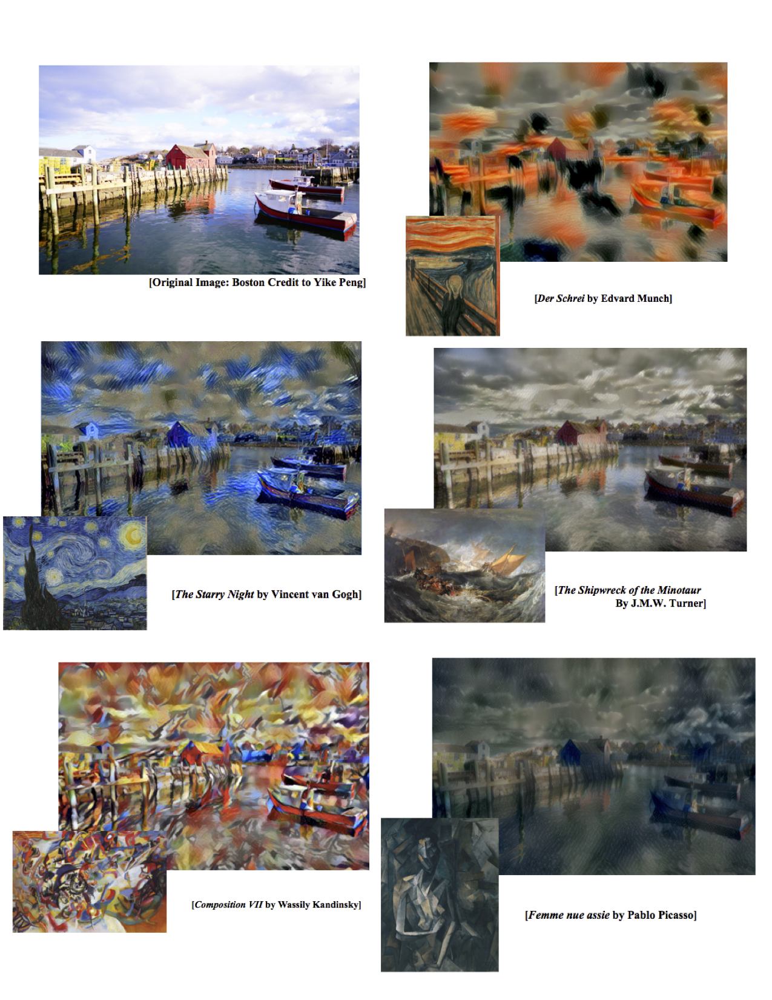
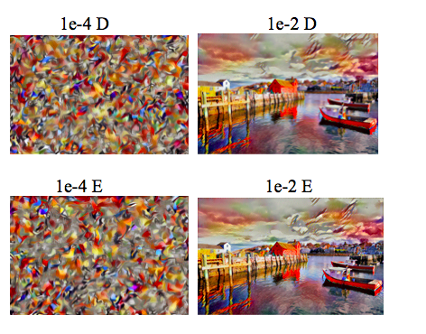

# ECBM E4040 Fall 2017 Final Project 

## Project Title: A Neural Algorithm of Artistic Style

+ Term: Fall 2017

+ Team ID: AAAA

### Team Members 

+ Qingyuan Zhang qz2283
+ Yike Peng yp2425
+ Renjie Li rl2928
 

### Link to original paper: https://arxiv.org/pdf/1508.06576v2.pdf

### File Description:

+ `neural_style.py` : main function to achieve content and style inputting, image synthesis, optimization and synthetic image generation 

+ `synthesis.py` : generate images which mix content with style

+ `style_layer_cal.py` : calculate style layer weights 
+ `feature_cal.py` : extract features of content and style in certain layers of CNN
+ `total_loss.py` : compute total loss function which consists of content loss and style loss, and implement noise-reduce optimization
+ `vgg.py` : provide VGG19-Networks

### Outlook





### Note 
To reproduce our work, clone the whole repository onto your own local machine. In your terminal, run this code:
```
python neural_style.py --content Pics/Content/boston.jpg --styles Pics/Styles/composition_vii.jpg --iterations 500 --output [your output path and output name]
```
Please make sure you download the [pre-trained VGG19 mat model](http://www.vlfeat.org/matconvnet/models/beta16/imagenet-vgg-verydeep-19.mat) into the `pretrained_VGG19` folder, and then run above code.

### Contribution statement:
 All team members contributed equally in all stages of this project. All team members approve our work presented in this repository including this contributions statement. 


